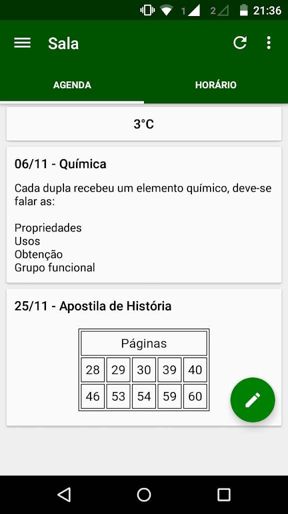
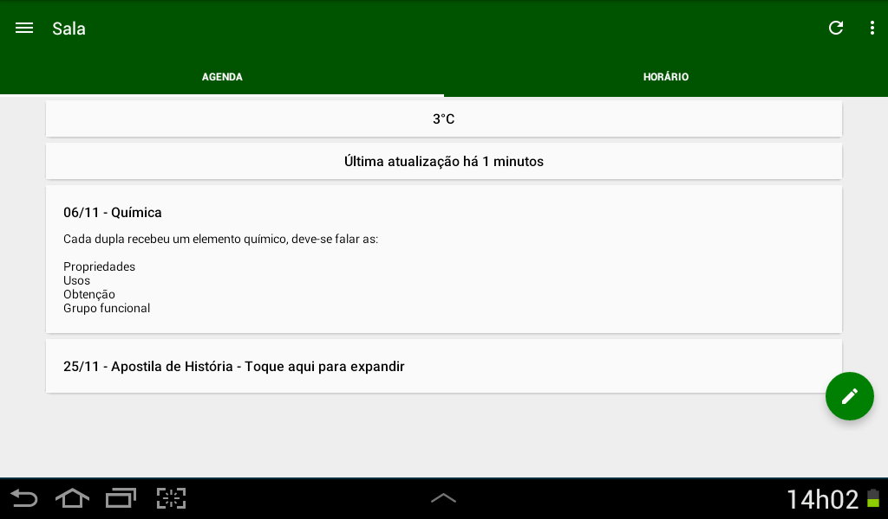
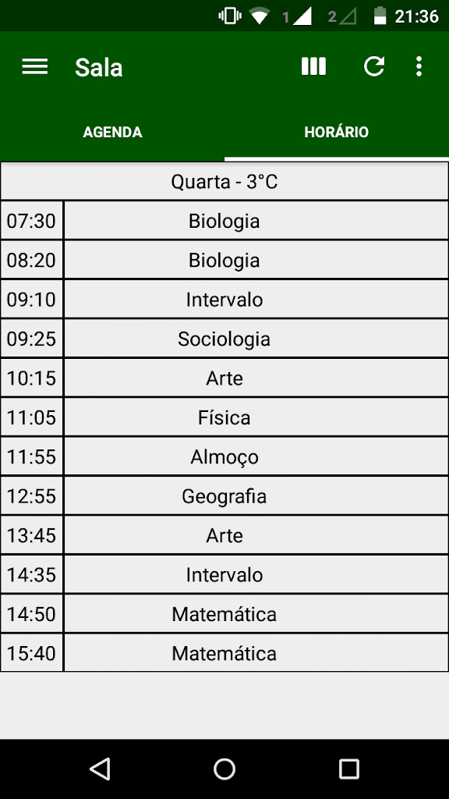
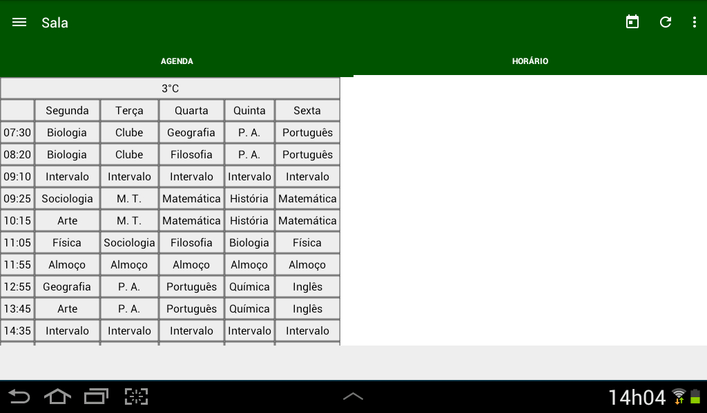
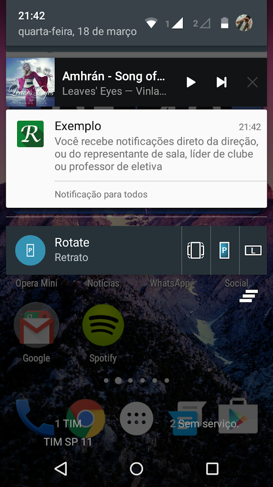
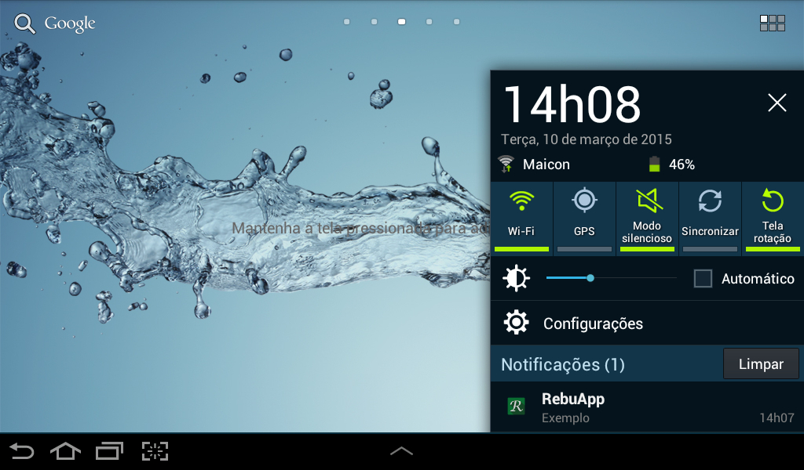

RebuApp
=======

RebuApp was an Android application, web app and Chrome extension designed to display the schedule and agenda for all classrooms, announcements from all clubs and elective courses at my former school, E. E. Profº Willian Rodrigues Rebuá, in Carapicuíba, São Paulo. The app also has [school library book search](./Screenshots/phone/6.jpg), an [integrated dictionary](./Screenshots/phone/7.jpg), announcements from the school, prices from the school canteen, [annotations](./Screenshots/phone/8.jpg) and [push notifications](./Screenshots/phone/3.jpg). 

The apps were developed between 2014 and 2015, when I was 17–18 years old, during my last year of high school and the year after.

Screenshots
-----

| Phone | Tablet 7" |
|-|-|
|  |  |
|  |  |
|  |  |

More screenshots [at this link](./Screenshots/).

There's also a Chrome extension with most of the app features, including push notifications, [in this repository](https://github.com/alefesouza/schoolapp-chrome).

<table>
    <tr>
        <th colspan="3">Chrome Extensions Screenshots</th>
    </tr>
    <tr>
        <td>
            
        </td>
        <td>
            
        </td>
        <td>
            
        </td>
    </tr>
</table>

You can access the PHP back-end code repository [by clicking here](https://github.com/alefesouza/schoolapp-backend). Since at the time I didn't have experience developing applications for other platforms, the back-end also includes a web app version made in Material Design with Polymer, with that users of iOS or Windows Phone could access it normally, the web app tries to integrate as much as possible with each operating system. For example, if you pin a tile to Windows, the tile will display the latest events and notifications. You can see all the integrations by [clicking here](https://github.com/alefesouza/schoolapp-backend/blob/master/Screenshots/Evolution/README.md#facilidades), it was a PWA written in 2015, when almost no one was talking about PWAs.

| Windows | Win Phone | iOS | Firefox OS |
|-|-|-|-|
|  |  |  |  |
|  |  |  |  |
|  |  |  |  |

This application was licensed under the GNU GPLv3 license until version 1.5, until I decided to publish backups of the more recent versions under the Apache License 2.0. I think at the time (2015) I had put a lot of effort into this application and didn't want to leave the more recent versions open source because I thought I could monetize it, since it was a more native application, and not just a set of WebViews like the previous versions.

Since I was just starting to learn Java and object-oriented programming at the time, don't expect to see many best practices, I only drew inspiration from the code structure of other programmers I saw on GitHub.

This is the code for version 2.1.7 released on April 7, 2015.

##### Portuguese

RebuApp foi um aplicativo para Android que visava ter o horário e agenda de todas as salas, recados de todos os clubes e eletivas de uma antiga escola minha, a E. E. Profº Willian Rodrigues Rebuá, em Carapicuíba, São Paulo. O aplicativo também possui [busca de livros da biblioteca](./Screenshots/phone/6.jpg) da escola, um [dicionário integrado](./Screenshots/phone/7.jpg) e recados com preços da cantina, [anotações](./Screenshots/phone/8.jpg) e notificações push.

Você pode baixa-lo na [Google Play Store](http://play.google.com/store/apps/details?id=aloogle.rebuapp).

Esse aplicativo estava em licença GNU GPLv3 até a versão 1.5, até que decidi publicar os backups das versões mais recente sob licença Apache License 2.0, acho que na época (2015) eu tinha me esforçado muito nesse aplicativo e não queria deixar as versões mais recentes em código aberto, já que ele era um aplicativo mais nativo, e não só um conjunto de WebView como nas versões anteriores.

Como eu nunca tinha cursado Java ou orientação a objetos na época, não espere ver muitas boas práticas, eu só me inspirava na estrutura código de outros programadores que via pelo GitHub.

Esse é o código da versão 2.1.7 lançada em 07/04/2015

Também tem uma extensão para Chrome com algumas funcionalidades do app [aqui](https://github.com/alefesouza/schoolapp-chrome).

Você pode acessar o código do back-end em PHP [clicando aqui](https://github.com/alefesouza/schoolapp-backend), como na época eu não tinha conhecimento no desenvolvimento de aplicativos para outras plataformas, no back-end também há uma versão web do aplicativo feita em Material Design com Polymer, para quem usasse iOS ou Windows Phone pudesse acessar normalmente.

Licença
----------

    Copyright (C) 2015 Alefe Souza <contato@alefesouza.com>

    Licensed under the Apache License, Version 2.0 (the "License");
    you may not use this file except in compliance with the License.
    You may obtain a copy of the License at

        http://www.apache.org/licenses/LICENSE-2.0

    Unless required by applicable law or agreed to in writing, software
    distributed under the License is distributed on an "AS IS" BASIS,
    WITHOUT WARRANTIES OR CONDITIONS OF ANY KIND, either express or implied.
    See the License for the specific language governing permissions and
    limitations under the License.
